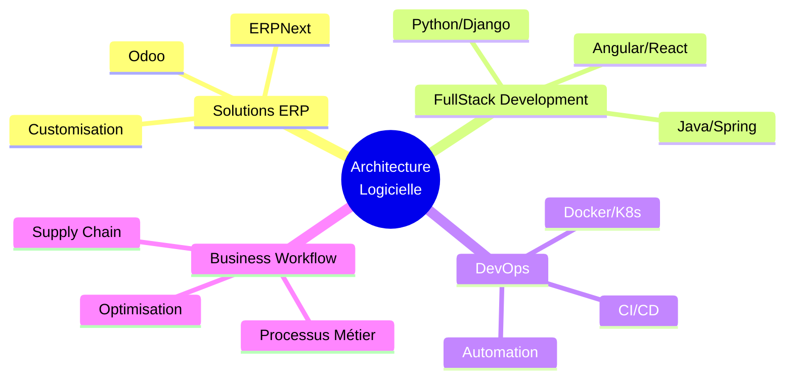

# 👋 Bonjour, je suis Bonevy BEBY

  

## 🚀 À propos de moi

Architecte logiciel senior passionné par la création de solutions d'entreprise robustes et scalables. Expert en développement FullStack avec une spécialisation en systèmes ERP et automatisation des workflows métier.

- 🏢 **Formation KILO** - [formationkilo.com](https://www.formationkilo.com/)
- 📍 **Localisation** : Dakar, Sénégal
- 💼 **Spécialités** : Architecture Logicielle, Solutions ERP, DevOps
- 🎓 **Formateur** : Supply Chain & Développement
- 🌐 **Site web** : [formationkilo.com](https://www.formationkilo.com/)

---

## 💻 Stack Technique

### Langages de Programmation

### Frontend

### Backend & Frameworks

### ERP & Business Solutions

### DevOps & Tools

### Bases de Données

---

## 🎯 Domaines d'Expertise

---

## 🏆 Projets Phares

### 🔐 [Authentification OAuth2 & JWT](https://github.com/zoulou421/social-login-oauth2-springsecurity6-springboot3)
**Spring Boot 3 | Spring Security 6 | OAuth2**
- Implémentation complète de l'authentification sociale
- Support Google, Facebook, GitHub
- JWT Token Management
- Architecture sécurisée moderne

### 🏦 [SOAP Banking Web Service](https://github.com/zoulou421/soap-banque)
**Java | Spring Boot | SOAP**
- Service bancaire basé sur SOAP
- Architecture orientée services (SOA)
- Gestion des comptes et transactions
- Documentation WSDL complète

### 📱 [Todo App Kotlin](https://github.com/zoulou421/TodoAppKotlin)
**Kotlin | Jetpack Compose | Android**
- Application mobile moderne avec Jetpack Compose
- Architecture MVVM
- Opérations CRUD complètes
- UI/UX native Android

### 📝 [Django Blog Platform](https://github.com/zoulou421/DocBlog_Django_Project)
**Python | Django | PostgreSQL**
- Plateforme de blog documentée
- Authentification utilisateur
- Système de commentaires
- Panel d'administration

### 🔑 [Node.js JWT Authentication](https://github.com/zoulou421/nodejs-authentication-with-JWT)
**Node.js | Express | JWT**
- Système d'authentification sécurisé
- Token-based authentication
- Refresh token implementation
- API RESTful

---

## 📊 Statistiques GitHub

  

---

## 🎓 Services & Formation

### 💼 Consulting IT
- Architecture logicielle & design patterns
- Migration vers solutions ERP
- Audit de code & optimisation
- Stratégie DevOps

### 📚 Formation
- Développement FullStack (Java, Python, JavaScript)
- Solutions ERP (Odoo, ERPNext)
- Supply Chain Management
- Best practices DevOps

### 🏢 Solutions ERP
- Implémentation Odoo/ERPNext
- Customisation de modules
- Intégration système
- Formation utilisateur

---

## 🌐 Me Contacter

---

## 📈 Contribution Activity

---

## 💡 Citation

> "La simplicité est la sophistication suprême." - Leonardo da Vinci

---

### ⭐️ From [zoulou421](https://github.com/zoulou421) with ❤️

